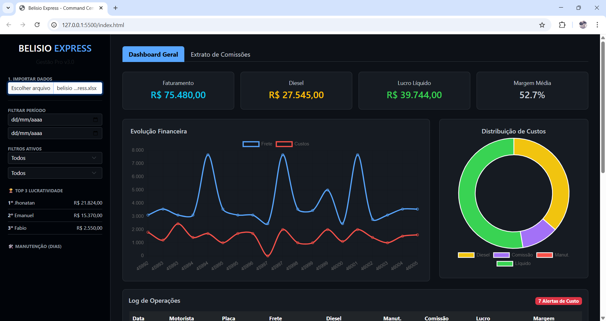

# 🚛 Belisio Express

O **Belisio Express** é uma plataforma de Business Intelligence (BI) de alto desempenho para gestão logística. O sistema processa dados de fretes, custos operacionais e manutenções para fornecer uma visão clara da lucratividade em tempo real.

## 🚀 Funcionalidades Principais

* **Dashboard Geral:** Visualização instantânea de Faturamento, Diesel, Lucro Líquido e Margem.
* **Análise de Custos:** Gráficos interativos de evolução financeira e distribuição de despesas.
* **Extrato de Comissões:** Resumo detalhado de pagamentos acumulados por motorista.
* **Alertas Críticos:** Identificação automática de viagens com baixa margem ou custos de diesel excedentes (acima de 45%).
* **Gestão de Manutenção:** Monitoramento do tempo decorrido desde a última intervenção por placa.

## 📊 Estrutura do Arquivo de Dados

Para que o sistema processe as informações corretamente, sua planilha Excel (`.xlsx`) deve conter as seguintes colunas na primeira aba:

| Coluna | Descrição | Exemplo |
| :--- | :--- | :--- |
| **Data** | Data da operação | 20/12/2025 |
| **Motorista** | Nome do colaborador | João Silva |
| **Placa** | Identificação do veículo | ABC-1234 |
| **Frete** | Valor total bruto do frete | 5000,00 |
| **Diesel** | Gasto com combustível | 1800,00 |
| **Manutencao** | Custos de reparos/peças | 250,00 |
| **Comissoes** | Valor destinado ao motorista | 600,00 |

> **Nota:** O sistema é inteligente e ignora acentos ou letras maiúsculas nos nomes das colunas, mas os nomes devem ser estes listados acima.

## 🛠️ Tecnologias Utilizadas

* [Chart.js](https://www.chartjs.org/) - Gráficos dinâmicos.
* [SheetJS (XLSX)](https://sheetjs.com/) - Processamento de planilhas no navegador.
* [Bootstrap 5](https://getbootstrap.com/) - Layout responsivo e moderno.

## 💻 Como Usar

1.  Acesse o link do projeto no GitHub Pages.
2.  Clique no botão **"Importar Dados"**.
3.  Selecione seu arquivo `.xlsx`.
4.  Utilize os filtros de **Data**, **Motorista** ou **Placa** na lateral esquerda para refinar a análise.

---
*Desenvolvido para gestão de alta performance na Belisio Express.*# Dashboard-Financeiro-Transportes
Dashboard Financeiro Transportes
